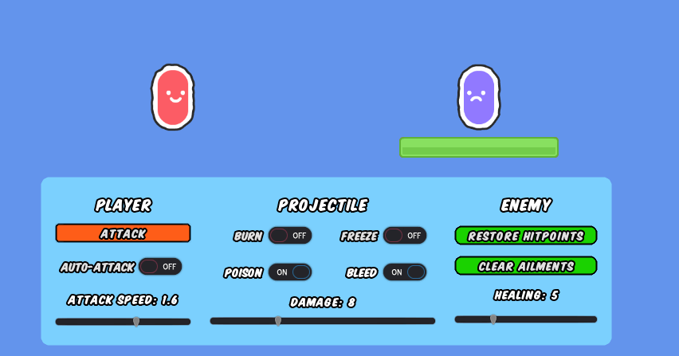
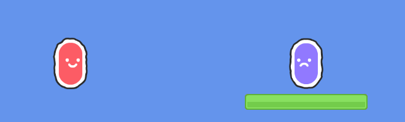

# `Reuty's Damage Lab - Welcome!`

This project provides some code for a simple projectile-plus-ailments system. The player can shoot an arrow which can do damage, apply a burn, poison, bleed, or freeze, and change some of the damage system's parameters like attack speed (for auto-attack), projectile damage, and enemy health regeneration.

This toy project is designed to help learn how damage systems work and how they can be implemented in Godot! Feel free to use this code anywhere you like, crediting [@not_reuty](https://twitter.com/not_reuty) is not required but greatly appreciated!

A huge thank you to [Kenney](https://twitter.com/KenneyNL) for making the assets public, and to the creator of [Komika Title](https://www.dafont.com/komika-title.font) (the font used throughout)!

## `Ailments`
An ailment here is a lasting effect which does damage to an enemy, such as poison, burning, or bleeding. This project implements several example ailments and shows how each one can be seperated so that more can be added or the existing ones can be changed. When implementing ailments, think about what could happen when the effect is first applied, what effect the ailment has over time, and how long it will last. Also think about what will happen if another effect is applied and how they will interact, and what happens if for example an enemy is hit with poison twice in a row.

Let's start by summarising how the ailments in the `damage lab` work;

### `Burn`
The burn effect is based on the size of the initial damage inflicted, and applies a damage over time effect which reduces in severity as it wears off. The first `tick` of burn damage equals 40% of the size of the initial hit, dealing 10% less damage per tick over 4 seconds total. This means that with an initial hit of 20, the damage taken due to burning will be 8, 6, 4, 2 every second after the hit (not including the hit itself), equal to 40 damage in total over 4 seconds.

Subsequent burning attacks will refresh the burn damage timer to 4 seconds, raising the burn damage if the new hit is larger than the first. This means that a large burn can be applied with a large attack, and can be refreshed with a smaller burning attack.

### `Poison`
Poisoned attacks apply a damage over time effect with a constant severity, with a duration equal to half the size of the initial hit (in seconds). In this project, the constant severity means 2 damage per tick, at a rate of 2 ticks per second, no matter the size of the initial hit. This means that with an initial hit of 20, the damage taken due to poison will last for 10 seconds, dealing 2 ticks of 2 damage per second, equal to 60 damage over 10 seconds in total.

Subsequent poison attacks will add to the poison duration timer, and will not change the severity of the poison. This means that two poison attacks of size 20 will each apply a 10 second poison duration, resulting in a 20 second poison duration overall. This also means that as long as an enemy is attacked with 20 poison damage every 10 seconds or more, the poison will last indefinitely.

### `Bleed`
Bleed attacks apply a damage over time effect which scales with the initial hit size similar to burn (but half as much), but lasts twice as long. Bleeding enemies also regenerate health at half their normal rate. This means that with an initial hit of 20, the damage taken due to bleed will be 4, 4, 3, 3, 2, 2, 1, 1, every second after the hit, equal to 40 damage in total over 8 seconds. 

Subsequent bleed attacks will add to the duration of the existing bleed, and will re-calculate the bleed size. This means that a smaller bleeding attack will effectively cancel a larger initial bleed, but will apply it for a longer duration. It also means that many small bleeds can stack together to apply a damage over time larger than any of the hits. This makes the 'death by a thousand cuts' possible with a high attack speed and small hits.

### `Freezing`
Freezing attacks don't apply a damage over time effect, instead they apply double damage but make the enemy invulnerable (frozen) for one second.

Attacks to a frozen enemy do nothing. Freezing an enemy with other status effects applied prevents any damage from being applied by them, but does not stop them from expiring. This means that an enemy with a 10 second bleed or poison that is then frozen will not take damage during the freeze (one second), but will then continue taking damage for the remaining 9 seconds from the bleed or poison once the freeze effect wears off.

Freezing is an example of an 'interacting ailment', because frozen enemies are affected by other ailments differently. In terms of code, this means that each ailment needs to account for the `is_frozen` boolean value, applying or not applying damage depending on the value.

## `User Interface`
Each of the ailment buttons on the user interface links to the script attached to the `enemy`. In code terms each enemy needs to be aware that it can be poisoned/burned etc, and how to respond to those events/ailments when they are applied. By default, the enemy cannot have any ailments applied, and they are added whenever the enemy takes damage (if enabled). This code could be moved to the projectile or the player in an actual game without this kind of UI.

## `Want to know more?`
I'd like to help - tweet me [@not_reuty]9https://twitter.com/not_reuty) any questions you have about this project and I'll do my best to answer them. Good Luck!
